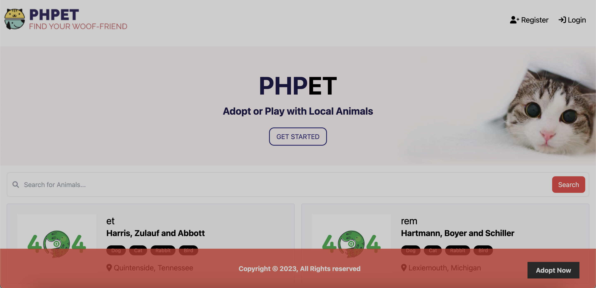

   
    
      <a href="https://github.com/quynhngandao/PHPet">
    <h3 align="center">  PHPet </h3>
  </a>
 <a href="#screenshot">View Demo</a>
  

          A platform that connect you to local shelters so that you can find your next Woofriend.
     
     
  

### **Table Of Content**

  

  <ul>
        <li><a href="#built-with">Built With</a></li>
        <li><a href="#prerequisites">Prerequisites</a></li>
        <li><a href="#installation">Installation</a></li>
         <li><a href="#screenshot">Screenshot</a></li>
  </ul>

### **Built With**
 

  
   &nbsp;
     
   &nbsp;
    
  &nbsp;
   
  &nbsp;

### **Prerequisites**
Before you get started, make sure you have the following software installed on your computer:
* [PHP](https://www.php.net/)
* [Laravel Herd](https://herd.laravel.com/) 
* [Composer](https://getcomposer.org/)
* [mySQL](https://www.mysql.com/)

### **Installation**
1. Fork and Clone the repository to your local computer using SSH key
1. Create a `.env` file using the `.env.example` template at the root of the project and make correct changes to the `CHANGE_THIS_INPUT`
1. Navigate to `https://<your-project-name>.test/`

### **Screenshot**

 

<a href="#top">back to top</a>

<!-- MARKDOWN LINKS & IMAGES -->
<!-- https://www.markdownguide.org/basic-syntax/#reference-style-links -->

# PHPet

